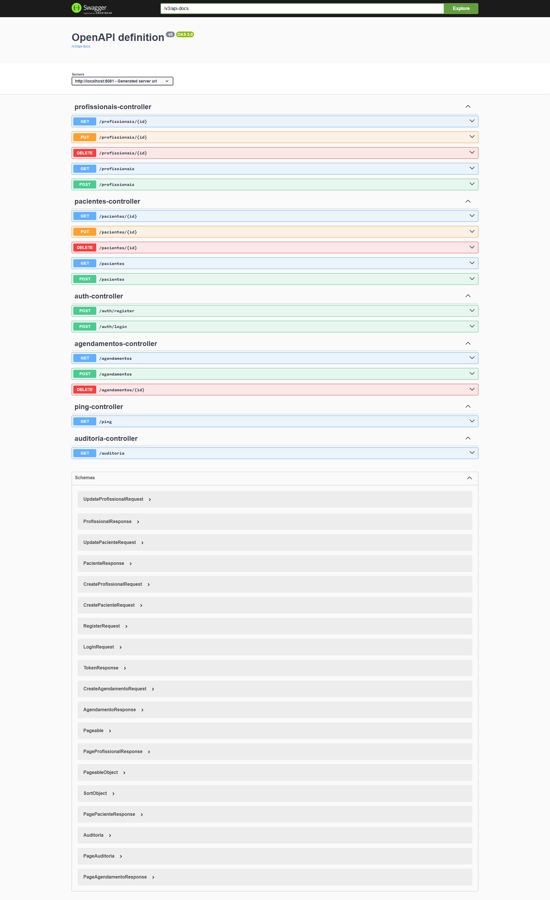
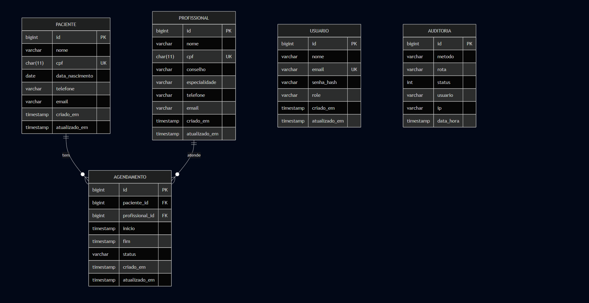
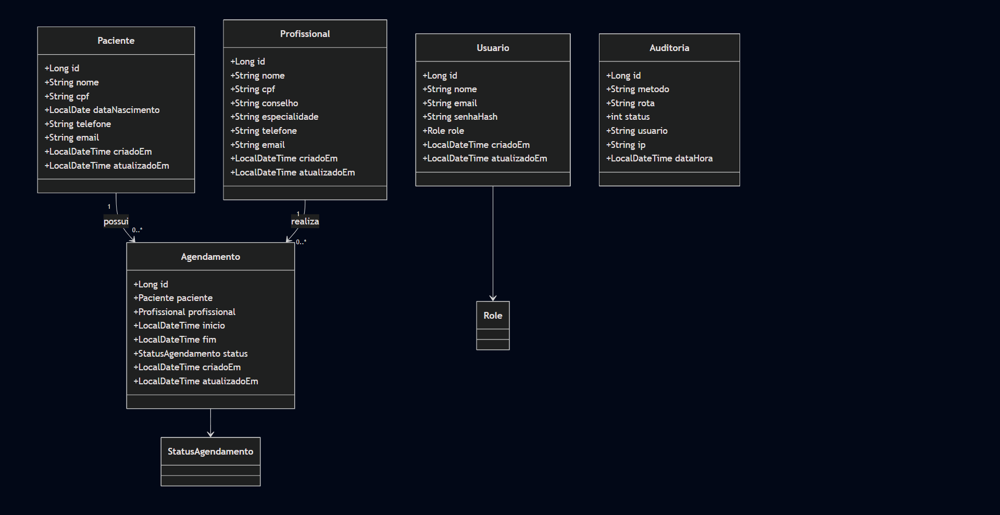
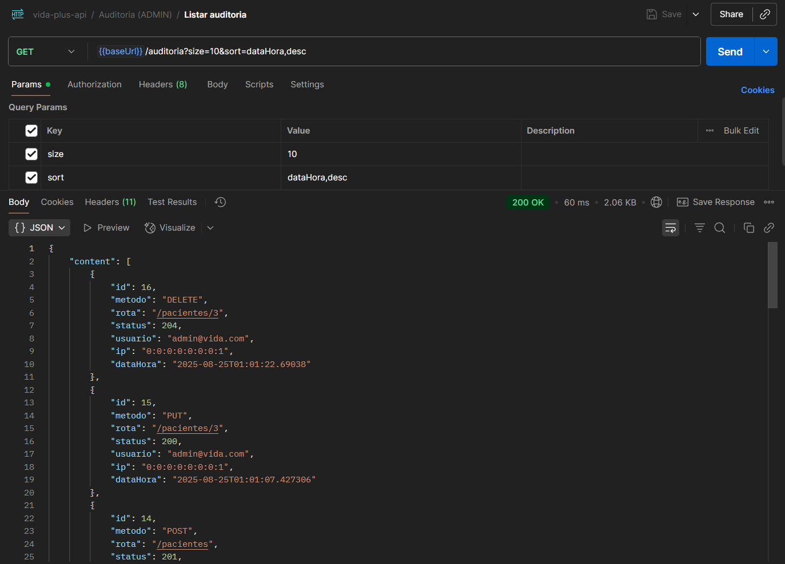
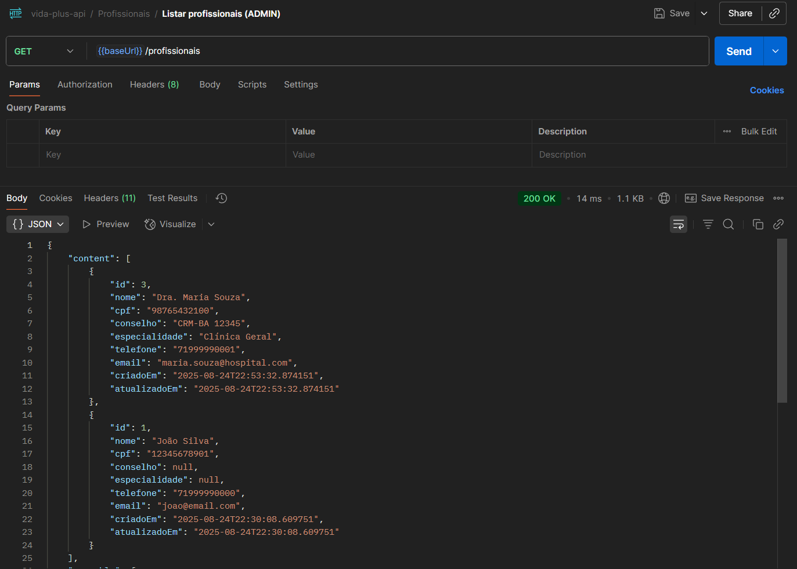

PROJETO – DESENVOLVIMENTO BACK-END

Sistema de Gestão de Saúde Simplificado (VidaPlus API)

Aluno: Jorlan Lancaster da Silva Braga — RU: 4140346
Curso: Análise e Desenvolvimento de Sistemas — Polo: Salvador/Iguatemi
Professor: Winston Sen Lun Fung, Me.
Data: 25/08/2025

1. Introdução

Este projeto implementa uma API REST para gestão de Pacientes, Profissionais de saúde e Agendamentos, com autenticação JWT, validações de negócio e auditoria.

O objetivo é demonstrar domínio da arquitetura em camadas (controller, service, repository), persistência com JPA/PostgreSQL, segurança com Spring Security e documentação via Swagger.

2. Objetivos

Funcionais:

CRUD de Pacientes e Profissionais

Agendamentos com validação de conflito

Auditoria de operações

Autenticação/Autorização

Não-funcionais:

Segurança (JWT/roles)

Validações (Bean Validation)

Documentação (Swagger)

Paginação/filtros

Qualidade de código e versionamento (GitHub)

3. Requisitos
3.1 Requisitos Funcionais (RF)

RF01 – Cadastrar/alterar/excluir/listar Pacientes

RF02 – Cadastrar/alterar/excluir/listar Profissionais (somente ADMIN)

RF03 – Criar/listar/cancelar Agendamentos (com conflito de horário)

RF04 – Autenticar usuário e autorizar por perfil (ADMIN/PROFISSIONAL)

RF05 – Registrar auditoria de POST/PUT/DELETE e /auth/login

3.2 Requisitos Não Funcionais (RNF)

RNF01 – Persistência em PostgreSQL via JPA/Hibernate

RNF02 – Segurança JWT; senhas com BCrypt

RNF03 – Documentação de endpoints com Swagger/OpenAPI

RNF04 – Paginação e filtros em listagens

RNF05 – Código organizado em camadas

4. Arquitetura da Solução

Camadas:

web (controllers)

service (regras de negócio)

repository (JPA)

domain (entidades)

Segurança: Spring Security + filtro JWT stateless; regras por rota (ADMIN vs autenticado)

Auditoria: filtro OncePerRequestFilter persistindo método, rota, status, usuário, IP

Documentação: springdoc-openapi UI (Swagger)

Migrações: Flyway (baseline + seed opcional)

📸 Print Swagger:

5. Modelagem de Dados
5.1 DER

(ver docs/DER.md)

📸 Print DER renderizado:

5.2 Diagrama de Classes

(ver docs/UML.md)

📸 Print UML:

6. Implementação
6.1 Principais Endpoints

Pacientes:
POST /pacientes · GET /pacientes · GET /pacientes/{id} · PUT /pacientes/{id} · DELETE /pacientes/{id}

Profissionais (ADMIN): mesmos verbos em /profissionais

Agendamentos:
POST /agendamentos · GET /agendamentos?profissionalId&pacienteId&data · DELETE /agendamentos/{id}

Auditoria (ADMIN):
GET /auditoria

Auth:
POST /auth/register · POST /auth/login

6.2 Regras de negócio de Agendamentos

Duração entre 15 e 180 minutos

inicio < fim e inicio no futuro

Sem sobreposição para o mesmo profissional: se [inicio, fim) colide com outro AGENDADO, retorna 409 Conflict

7. Segurança

JWT para autenticação; claim role (ADMIN/PROFISSIONAL)

Regras:

/profissionais/** e /auditoria/** → somente ADMIN

/pacientes/** e /agendamentos/** → qualquer usuário autenticado

/ping, /auth/**, /swagger-ui.html, /swagger-ui/**, /v3/api-docs/** → abertas

8. Auditoria

Registra POST/PUT/DELETE e /auth/login com: método, rota, status, usuário, IP, data/hora

Consulta: GET /auditoria?size=10&sort=dataHora,desc

📸 Print auditoria:

9. Plano de Testes (Postman)

Auth:

POST /auth/register → 201 Created

POST /auth/login → 200 OK → token salvo

Pacientes: CRUD completo (201/200/204/404/409)

Profissionais: CRUD (somente ADMIN) — 403 com token de PROFISSIONAL

Agendamentos: criar (201), conflito (409), cancelar (204), listar (200)

📸 Print dos testes (colocar aqui):

10. Como Executar

Criar DB/usuário no PostgreSQL

Ajustar application.yml se necessário

Rodar mvnw clean package -DskipTests + mvnw spring-boot:run

Swagger: http://localhost:8081/swagger-ui.html

11. Conclusão

O projeto cumpre os requisitos do trabalho, demonstrando API REST segura, validada, documentada e auditável.

Como evolução futura, sugere-se:

Testes automatizados

Versionamento completo de schema via Flyway

Deploy em container Docker

12. Referências

Documentação Spring (Boot, Data JPA, Security)

Documentação PostgreSQL

Springdoc OpenAPI

JJWT